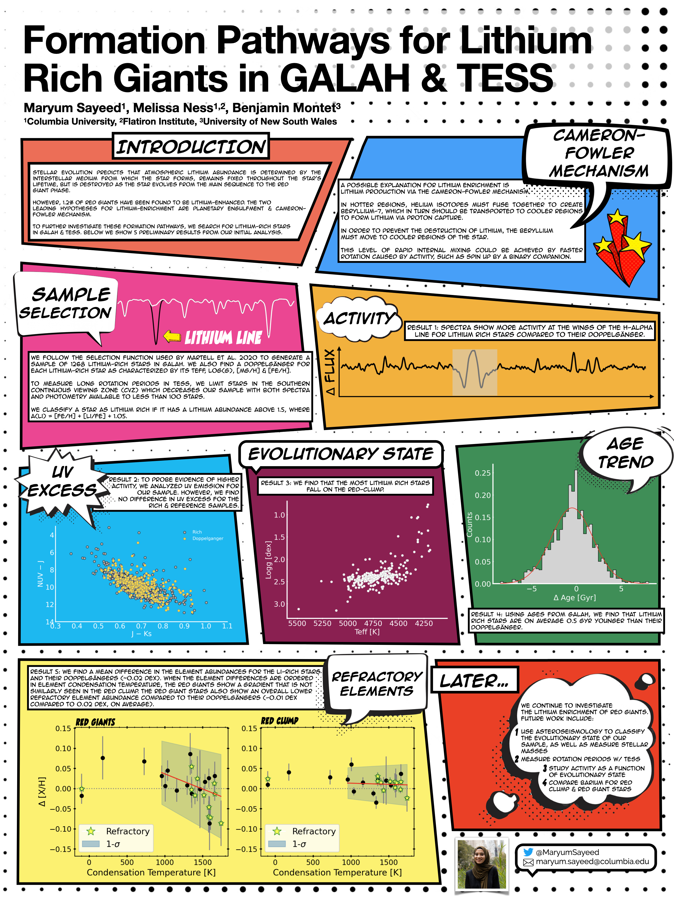
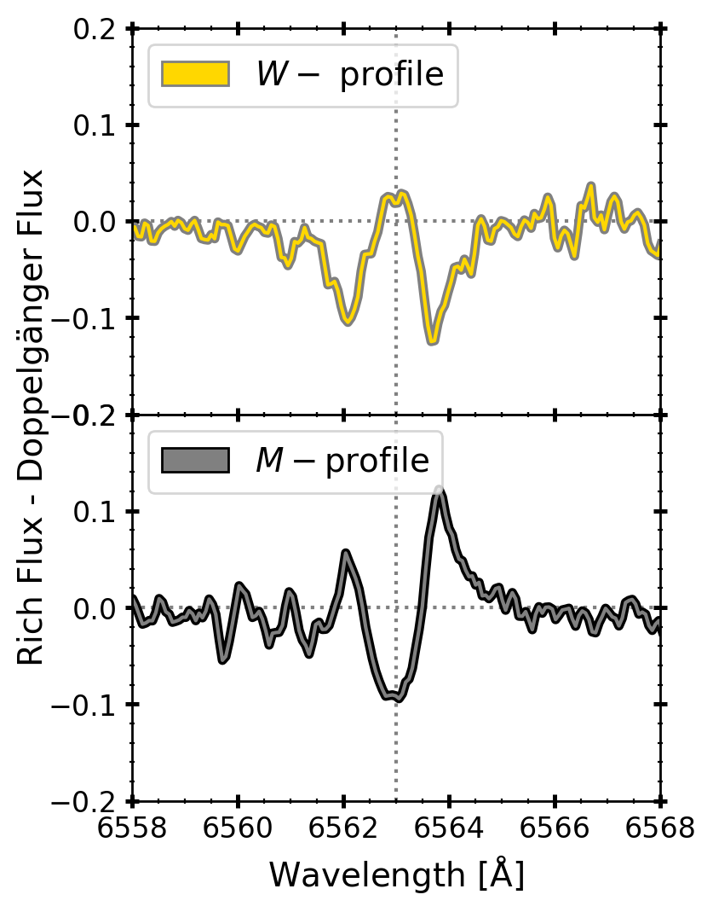
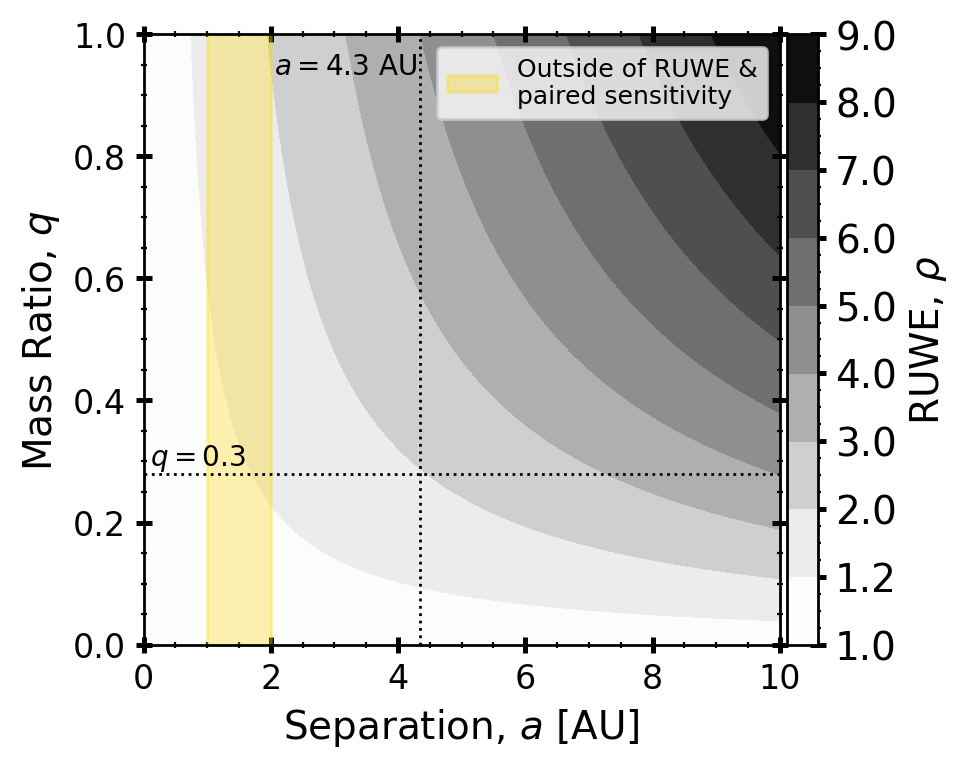

<!--  -->
The following images show selected figures from papers and posters presented at conferences. See caption and legend below for details.

Legend
------
* Paper A: [Lithium-Rich Red Giants]()
* Conf A: [TASC 6](https://fys.kuleuven.be/ster/events/conferences/2020/tasc6)



<!-- 

  
 
    
    
Poster presented at <a href="https://fys.kuleuven.be/ster/events/conferences/2020/tasc6">TASC 6</a>.

  

  
 
    
    
Poster presented at <a href="https://fys.kuleuven.be/ster/events/conferences/2020/tasc6">TASC 6</a>.

  

  
 
    
    
Figure 5 from paper on <a href="">lithium-rich red giants</a>.

  

  
 
    
    
Figure 17 from paper on <a href="">lithium-rich red giants</a>.

  

 -->
