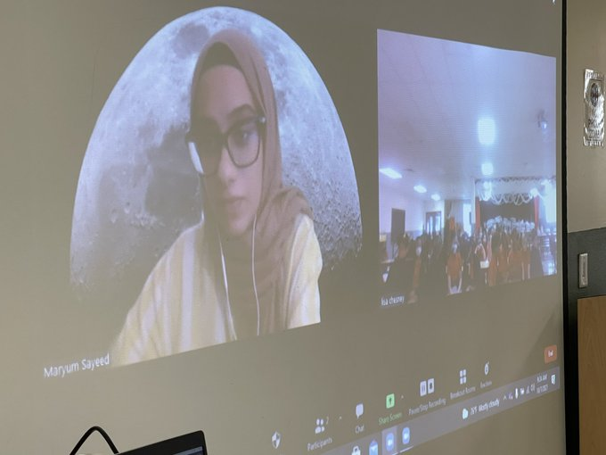
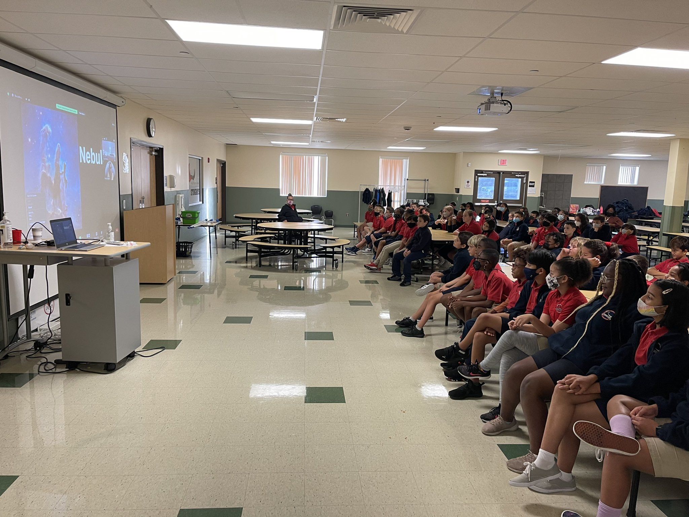



## Astrobites
I'm proud to be a writer for [Astrobites](https://astrobites.org/), a daily astrophysical literature journal written by graduate students in astronomy. The goal of the collaboration is to summarize daily scientific papers for undergraduate astronomy students, and make astronomy more accessible. Check out some of my articles below ([full list here](https://astrobites.org/author/msayeed/)).

&nbsp; &rarr; April 2022 - _[Women's History Month: Dr. Burçin Mutlu-Pakdil](https://astrobites.org/2022/04/10/template-post-10/)_ 
&nbsp; &rarr; March 2022 - _[Women's History Month: Dr. Munazza Alam](https://astrobites.org/2022/03/24/munazza-alam/)_ 
&nbsp; &rarr; January 2022 - _[Make it or Brake it: Supporting Weakened Magnetic Braking with Asteroseismology](https://astrobites.org/2022/01/28/weakened-magnetic-braking/)_

## Skype A Scientist
I'm a strong supporter of science communication, and sharing my passion for astronomy with younger students. As a volunteer for [Skype a Scientist](https://www.skypeascientist.com/), I have the opportunity to talk to students of all ages, answer questions and share what it means to be an astronomer. The image below shows one of my visits to elementary school classes in Florida.

  
   

## Mentorship
I'm passionate about mentorship at all levels of academia. I have multiple strong female mentors who have guided me throughout my studies, and I encourage women -- especially women of colour -- to surround themselves with people that appreciate your value.

