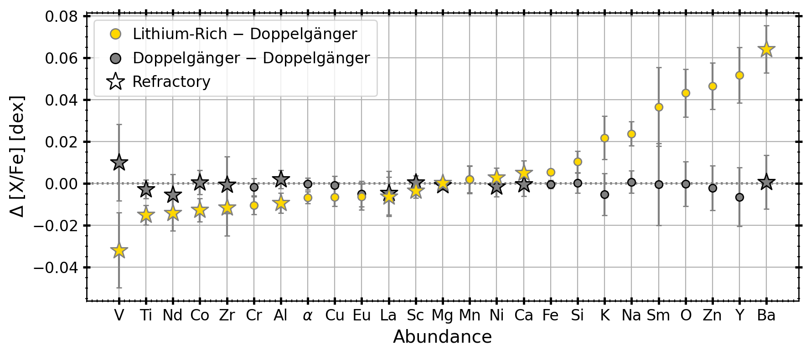
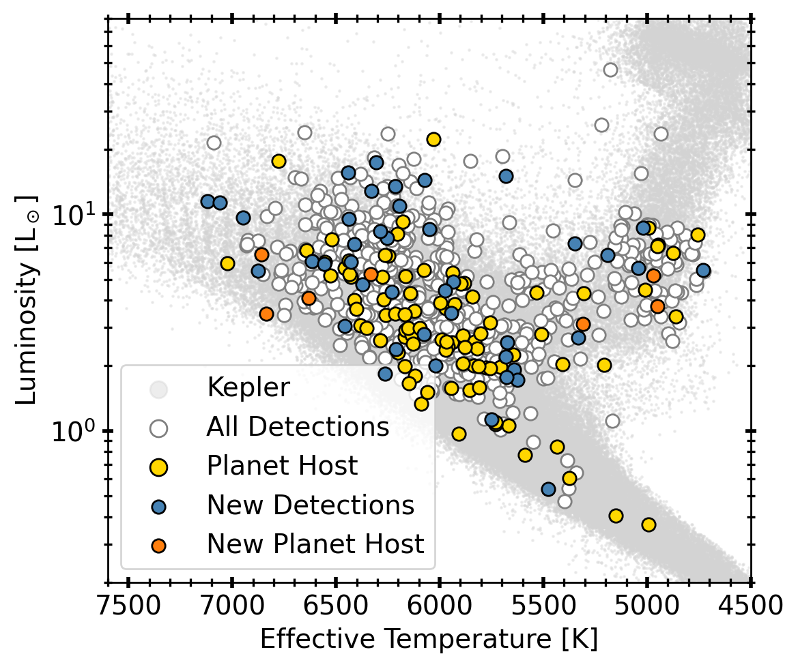
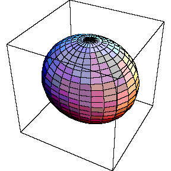
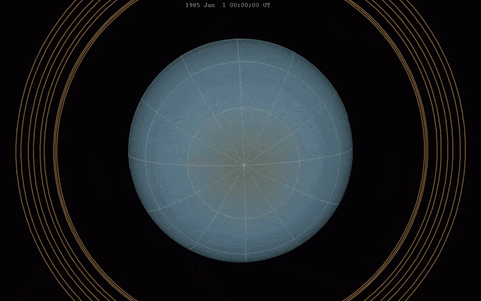



An up-to-date list of publications can be found on [NASA/ADS](https://ui.adsabs.harvard.edu/search/q=orcid%3A0000-0001-6180-8482&sort=date%20desc%2C%20bibcode%20desc&p_=0). 

I study the origins of weirdly behaving stars with spectroscopy and asteroseismology. My Ph.D. thesis has focused on lithium-rich (Li-rich) red giants and non-oscillating stars in Kepler. 

## Lithium in Red Giants
_Advisors: [Prof. Melissa Ness](https://rsaa.anu.edu.au/people/professor-melissa-ness), [Prof. Ben Montet](https://research.unsw.edu.au/people/dr-ben-montet), [Dr. Andrew Casey](https://astrowizici.st/)_  

Lithium-rich giants are a well-known population of chemically peculiar stars. Main-sequence stars go through a process known as the first dredge up phase when the star leaves the main-sequence. In this phase, material in the hotter, inner layers is dredged up to the surface, mixing with the cooler convective envelope. During this process, any species in the outer layer that is sensitive to hot temperatures -- such as lithium -- is destroyed. We expect lithium to be depleted by 1 dex during the first dredge up phase. However, large spectrosocpic surveys such as GALAH and LAMOST have found that 1% of red giants are enhanced in lithium. Many theories have been suggested to explain their formation, such as planet engulfment, mass transfer, and internal production, but no consensus has been established. Lithium-rich giants represent perhaps the most fundamental disagreement between theory and observations in stellar astrophysics. 

In [Sayeed et al. 2024](https://ui.adsabs.harvard.edu/abs/2024ApJ...964...42S/abstract), we analyzed a sample of 1100+ Li-rich red giants in GALAH. By comparing their stellar properties and abundaces against a sample of Li-normal stars, we found mean enhancements in s-process elements such as Ba and Y (see Figure 1), as well as higher than usual broadening velocities for select Li-rich giants. These findings suggested potential mass transfer from a companion, specifically an intermediate-mass asymptotic mass giant branch (AGB) star. However, in order to search for these companions, we first need to understand the binary parameter spaces these objects would occupy. For instance, are they in close or wide binary systems? And what are their mass ratios? To answer these questions, we used population synthesis tools.

   
   <strong>Figure 1.</strong> By doing a robust statistical analysis, we found that on average, the Li-rich sample is enhanced in s-process elements, such as Ba and Y, as compared to the Li-normal sample. Figure from <a href="https://ui.adsabs.harvard.edu/abs/2024ApJ...964...42S/abstract" target="_blank">
    Sayeed et al. 2024</a>.
    

In [Sayeed et al. 2025b](https://ui.adsabs.harvard.edu/abs/2025ApJ...991...73S/abstract), we used a binary population synthesis code called COSMIC to probe potential binary architectures of these systems assuming the companion is lithium-producing AGB star. Intermediate mass (4-8 $M_\odot$) AGB stars produce lithium via Hot Bottom Burning in their interiors in addition to s-process elements. Our study found that these objects are found at an average separation of 3 AU. Our analysis also suggested that Li-rich giants with A(Li) = 1.5-2.2 dex could have inherited lithium from their main-sequence based on GALAH main-sequence stars. 

In [Sayeed et al. 2025d](https://ui.adsabs.harvard.edu/abs/2025arXiv251017966S/abstract), we analyzed radial velocity data of a sub-sample of our Li-rich giants. We collected multi-epoch observations from ESPRESSO, a high-resolution spectrograph on the Very Large Telescope in Chile. Based on observations of 33 red giants, we recovered a companion fraction of 9/33, or 27%. We find that our binary companion sample has a higher prevalence of stars on the red clump ($\log g=2-3$ dex), and with lower lithium abundance (A(Li) = 1.5-2.0 dex). Further data are being collected to distinguish between various formation mechanisms of these objects. 

## Asteroseismology
_Advisors: [Prof. Daniel Huber](https://home.ifa.hawaii.edu/users/dhuber/)_  

NASA's Kepler mission revolutionized the field of asteroseismology, the study of stellar oscillations. Asteroseismology is useful for deriving fundamental stellar parameters, such as mass, radius, and even age. These parameters are particularly useful for exoplanet characterization. In [Sayeed et al. 2025c](https://ui.adsabs.harvard.edu/abs/2025AJ....170..212S/abstract), we published a homogenous catalog with 750+ solar-like oscillators in Kepler DR25 data, including 50 new detections, as well as planet hosts and rotators (see Figure 2). This catalog was useful in studying the effects of activity on oscillators and non-oscillators. Specifically, we used surface activity indicators from the Keck/HIRES spectrograph to improve our prediction of oscillation amplitudes. Non-oscillating stars present a challenge to stellar evolution theory; our work suggested that stellar activity modifies convection efficiency in ways that suppress oscillations, providing a framework to predict oscillation amplitudes for targets in upcoming missions such as Roman and PLATO.

  
   <strong>Figure 2.</strong> By re-analyzing Kepler DR25, we found 50 new solar-like oscillators. This is the largest and most complete sample of main-sequence and subgiant solar-like oscillators to date, and includes planet hosts and rotating stars. Figure from <a href="https://ui.adsabs.harvard.edu/abs/2025AJ....170..212S/abstract" target="_blank">
    Sayeed et al. 2025c</a>.
    

In addition, the abundance of time-series observations have motivated astronomers and machine learning experts to find efficient ways of data analysis. While asteroseismology is useful in deriving accurate stellar parameters, it is time consuming to apply on hundreds of thousands of stars at once efficiently. In [Sayeed et al. 2021](https://ui.adsabs.harvard.edu/abs/2021AJ....161..170S/abstract), we developed a data-driven method called `The Swan` to derive stellar surface gravities using linear regression for 20,000+ stars. `The Swan` achieves high precision and can be applied for cool stars across the Hertzsprung-Russell diagram (ie. main sequence, red clump, and red giant stars).

Finally, I am a co-developer of an open-source software called [`pySYD`](https://pysyd.readthedocs.io/en/latest/), a tool for global asteroseismic analysis. Based on the IDL version of the code ([`SYD`](https://ui.adsabs.harvard.edu/abs/2009CoAst.160...74H/abstract)), `pySYD` locates the power-excess due to solar-like oscillations, corrects for the background, and provides a measurement of the frequency of maximum power ($\nu_{\rm max}$) and large frequency separation ($\Delta \nu$). More details about its methodology can be found in our [JOSS paper](https://ui.adsabs.harvard.edu/abs/2022JOSS....7.3331C/abstract). 

<!-- ## Asteroseismology & Machine Learning
_Advisors: [Prof. Daniel Huber](http://www.ifa.hawaii.edu/~dhuber/) & [Prof. Melissa Ness](http://user.astro.columbia.edu/~mkness/Home.html)_  
_Paper: on [NASA/ADS](https://ui.adsabs.harvard.edu/abs/2021AJ....161..170S/abstract)_ 
_Code: on [GitHub](https://github.com/MaryumSayeed/TheSwan)_

<!-- 

## Solar System Seismology
_Advisor: [Prof. Jason Rowe](https://physics.ubishops.ca/exoplanets/Jason_Rowe_cv.html)_  

NASA's Kepler mission discovered that planets like the ice giants - Uranus and Neptune - have higher occurrence rates in our galaxy, as compared to gas giants or Earth-like planets [Burke et al. 2015](https://ui.adsabs.harvard.edu/abs/2015ApJ...809....8B/abstract). Therefore, to understand the population of discovered exoplanets, it is crucial to understand the formation, internal structure, atmosphere and evolution of Uranus and Neptune.

We used seismology to study the interior structure of Uranus. Using observations from the K2 mission, we analyzed 40 days of continuous high-cadence photometry to measure seismic waves within Uranus, study its weather patterns, and observe the Sun using reflected light. Although we were unable to detect oscillations within Uranus, we measured solar oscillations using reflected light from the sun, and used asteroseismic scaling relations to derive solar mass and radius. For a similar study, check out [Rowe et al. 2017](https://ui.adsabs.harvard.edu/abs/2017AJ....153..149R/abstract).

## Gravitational Waves
_Advisor: [Prof. Jess McIver](https://phas.ubc.ca/users/jess-mciver)_  

Einstein's theory of General Relativity describes gravity as spacetime curvature created by massive objects. When two massive objects - such as black holes or neutron stars - accelerate towards each other, they radiate energy in the form of gravitational waves (GW), or waves that ripple through spacetime. While detecting these gravitational waves at large distances is difficult, the Laser Interferometer Gravitational-Wave Observatory (LIGO) uses laser interferometry to measure the distortion of mirror spacings as a gravitational wave passes through Earth (see [animation](https://www.ligo.caltech.edu/video/ligo20160211v6)). Click [this link](https://www.ligo.caltech.edu/video/ligo20160211v2) to hear the sound of two black holes colliding!

In order to analyze the data obtained by LIGO and differentiate random noise from coherent signal, physicists use extensive methods to remove noise - or "glitches" - from observations. I studied the impact of one of these glitches, called 'Blue Mountains' or high frequency noise, in order to understand the impact of glitches on parameter estimation of compact binary coalescence signals. Some factors that I studied are the effects of glitch proximity to the merger time, sky localization, and inferred masses and spins. I also updated the data analysis pipeline used to run parameter estimation on GW signals using a Bayesian inference software library called [LALInference](https://ui.adsabs.harvard.edu/abs/2015PhRvD..91d2003V/abstract).

## Planet Formation
_Advisor: [Prof. Nienke van der Marel](http://www.nienkevandermarel.com/)_  

The gravitational attraction between a protostar and surrounding dust grains causes larger pebbles to drift inward at timescales shorter than accretion timescales that prevent planet formation (termed the radial drift problem). However, the existence of a pressure bump within a disk would trap dust grains to buy time, and allow larger planetesimals to form.

This project aimed to observe IRS 48, the first asymmetric protoplanetary disk that showed evidence of a dust trap, in multiple wavelengths to model the morphology of the disk and investigate dust growth. I applied Markov chain Monte Carlo methods to model the disk using parameters for disk location, size and orientation, and created a spectral index map to probe dust distribution. -->

