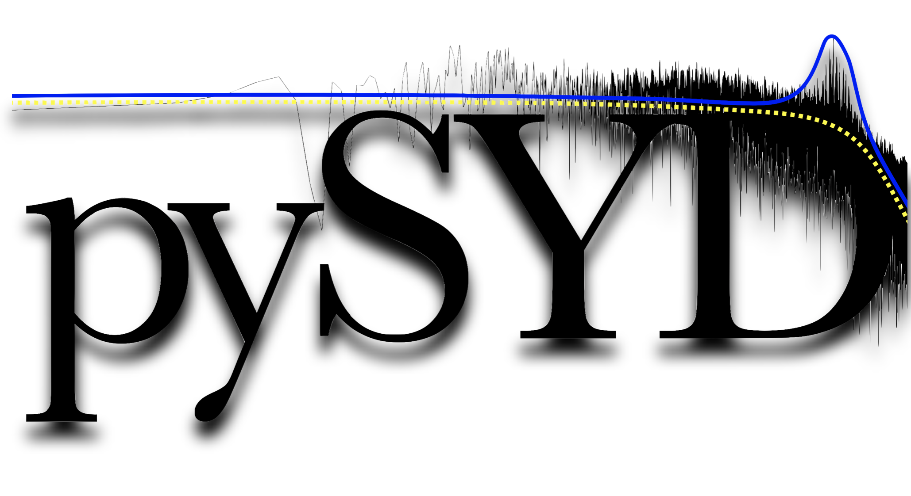



pySYD
=====
I've contributed to the development of `pySYD`, an open-source package in Python to detect solar-like oscillations and measure their global properties. For installation instructions, user guide, advanced usage and more, check out [Read The Docs](https://pysyd.readthedocs.io/en/latest/).

  

